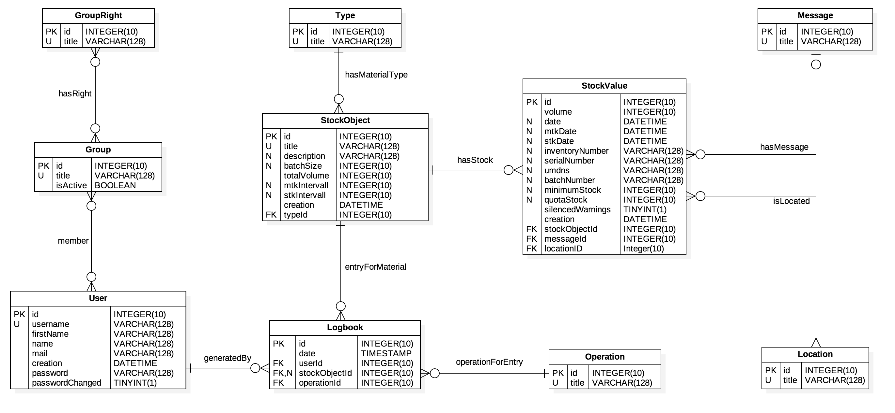
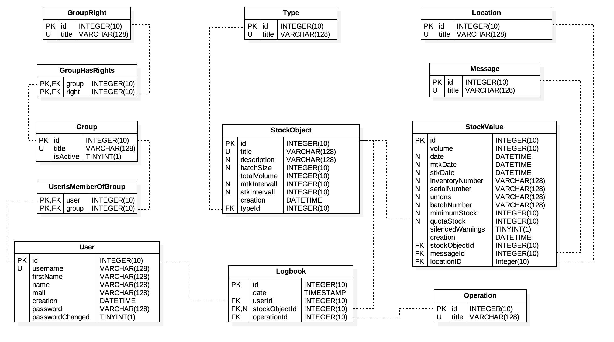

# ER-Model


Vorläufiger Entwurf des ER-Models, **request-for-comments**.

# Allgemein

Zunächst wird für das Projekt die Collation `latin1_german2_ci` verwendet, da diese am ehesten der "Telefonbuchsortierung" im deutschen entspricht. Alternativ wäre es auch denkbar gewesen `utf8_general_ci` zu verwenden, diese kann jedoch zu unerwarteten Sortierungen beim Aufkommen von Umlauten führen.

Für die Implementierung der `BOOLEAN` Werte wie passwordChanged und silenceWarning wird auf den Datentyp `TINYINT(1)` zurückgegriffen. Zum Thema BOOLEAN sagt die Dokumentation von MySQL folgendes:

- Bool, Boolean: These types are synonyms for TINYINT(1). A value of zero is considered false. Non-zero values are considered true.
- As of MySQL 5.0.3, the BIT data type is used to store bit-field values. A type of BIT(M) enables storage of M-bit values. M can range from 1 to 64.
- We intend to implement full boolean type handling, in accordance with standard SQL, in a future MySQL release.

Die Constraints der Tabellen `GroupHasRights` und `UserIsMemberOfGroup` müssen bezüglich ihrer `ON DELETE` und `ON UPDATE` Funktionen geprüft und besprochen werden. CASCADE gilt daher nur als Platzhalter für ein sinnvolles Verhalten, welches in den Anforderungen festgehalten werden sollte.

# EER-Model


Vorläufiger Entwurf des EER-Models, **request-for-comments**.

# SQL-Aufruf

## Group has Rights

Es handelt sich um eine **Many-To-Many Relationship** zwischen den Tabellen `Group` und `GroupRight`.

```sql
CREATE TABLE `GroupRight` (
    `id` int(10) unsigned NOT NULL AUTO_INCREMENT PRIMARY KEY,
    `title` varchar(128) COLLATE 'latin1_german2_ci' NOT NULL UNIQUE
) COLLATE 'latin1_german2_ci';

CREATE TABLE `Group` (
    `id` int(10) unsigned NOT NULL AUTO_INCREMENT PRIMARY KEY,
    `title` varchar(128) COLLATE 'latin1_german2_ci' NOT NULL UNIQUE,
    `isActive` tinyint(1) unsigned NOT NULL
) COLLATE 'latin1_german2_ci';

CREATE TABLE `GroupHasRights` (
    `group` int(10) unsigned NOT NULL,
    `right` int(10) unsigned NOT NULL,
    CONSTRAINT `Constr_GroupHasRights`
        FOREIGN KEY `group_fk` (`group`) REFERENCES `Group` (`id`)
        ON DELETE CASCADE ON UPDATE CASCADE,
    CONSTRAINT `Constr_RightHasGroups`
        FOREIGN KEY `right_fk` (`right`) REFERENCES `GroupRight` (`id`)
        ON DELETE CASCADE ON UPDATE CASCADE
) COLLATE 'latin1_german2_ci';
```
## User is Member of Group

Es handelt sich um eine **Many-To-Many Relationship** zwischen den Tabellen `User` und `Group`.

```sql
CREATE TABLE `User` (
    `id` int(10) unsigned NOT NULL AUTO_INCREMENT PRIMARY KEY,
    `username` varchar(128) COLLATE 'latin1_german2_ci' NOT NULL UNIQUE,
    `firstname` varchar(128) COLLATE 'latin1_german2_ci' NOT NULL,
    `name` varchar(128) COLLATE 'latin1_german2_ci' NOT NULL,
    `mail` varchar(128) COLLATE 'latin1_german2_ci' NULL,
    `creation` datetime NOT NULL,
    `password` varchar(128) COLLATE 'latin1_german2_ci' NOT NULL,
    `passwordChanged` tinyint(1) unsigned NOT NULL
) COLLATE 'latin1_german2_ci';

CREATE TABLE `UserIsMemberOfGroup` (
    `user` int(10) unsigned NOT NULL,
    `group` int(10) unsigned NOT NULL,
    CONSTRAINT `Constr_UserHasGroup`
        FOREIGN KEY `user_fk` (`user`) REFERENCES `User` (`id`)
        ON DELETE CASCADE ON UPDATE CASCADE,
    CONSTRAINT `Constr_GroupHasUser`
        FOREIGN KEY `group_fk` (`group`) REFERENCES `Group` (`id`)
        ON DELETE CASCADE ON UPDATE CASCADE
) COLLATE 'latin1_german2_ci';
```

## Material

Beinhaltet verschiedene **To-One Relationships** zwischen der `Material` Tabelle und den `Location`, `Message` und `Type` Tabellen.

```sql
CREATE TABLE `Location` (
    `id` int(10) unsigned NOT NULL AUTO_INCREMENT PRIMARY KEY,
    `title` varchar(128) COLLATE 'latin1_german2_ci' NOT NULL UNIQUE
) COLLATE 'latin1_german2_ci';

CREATE TABLE `Message` (
    `id` int(10) unsigned NOT NULL AUTO_INCREMENT PRIMARY KEY,
    `title` varchar(128) COLLATE 'latin1_german2_ci' NOT NULL UNIQUE,
    `escalation` int(10) unsigned NOT NULL UNIQUE
) COLLATE 'latin1_german2_ci';

CREATE TABLE `Type` (
    `id` int(10) unsigned NOT NULL AUTO_INCREMENT PRIMARY KEY,
    `title` varchar(128) COLLATE 'latin1_german2_ci' NOT NULL UNIQUE
) COLLATE 'latin1_german2_ci';

CREATE TABLE `StockObject` (
   `id` int(10) unsigned NOT NULL AUTO_INCREMENT PRIMARY KEY,
   `title` varchar(128) COLLATE 'latin1_german2_ci' NOT NULL UNIQUE,
   `description` varchar(128) COLLATE 'latin1_german2_ci' NULL,
   `minimumStock` int(10) unsigned NULL,
   `quotaStock` int(10) unsigned NULL,
   `batchSize` int(10) unsigned NULL,
   `totalVolume` int(10) unsigned NULL,
   `mtkIntervall` int(10) unsigned NULL,
   `stkIntervall` int(10) unsigned NULL,
   `creation` datetime NOT NULL,
   `silencedWarning` tinyint(1) unsigned NOT NULL,
   `typeId` int(10) unsigned NOT NULL ,
   CONSTRAINT `Constr_Stock_Type`
       FOREIGN KEY `type_fk` (`typeId`) REFERENCES `Type` (`id`)
       ON DELETE CASCADE ON UPDATE CASCADE
) COLLATE 'latin1_german2_ci';

CREATE TABLE `StockValue` (
   `id` int(10) unsigned NOT NULL AUTO_INCREMENT PRIMARY KEY,
   `volume` int(10) unsigned NOT NULL,
   `date` DATETIME NULL,
   `mtkDate` DATETIME NULL,
   `stkDate` DATETIME NULL,
   `inventoryNumber` varchar(128) COLLATE 'latin1_german2_ci' NULL,
   `serialNumber` varchar(128) COLLATE 'latin1_german2_ci' NULL,
   `umdns` varchar(128) COLLATE 'latin1_german2_ci' NULL,
   `batchNumber` varchar(128) COLLATE 'latin1_german2_ci' NULL,
   `creation` datetime NOT NULL,
   `escalationAck` int(10) unsigned NOT NULL,
   `stockObjectId` int(10) unsigned NOT NULL,
   `locationId` int(10) unsigned NOT NULL,
   `messageId` int(10) unsigned NOT NULL,
   CONSTRAINT `Constr_StockValue_StockObject`
       FOREIGN KEY `stockObject_fk` (`stockObjectId`) REFERENCES `StockObject` (`id`)
       ON DELETE CASCADE ON UPDATE CASCADE,
   CONSTRAINT `Constr_StockValue_Location`
       FOREIGN KEY `location_fk` (`locationId`) REFERENCES `Location` (`id`)
       ON DELETE CASCADE ON UPDATE CASCADE,
   CONSTRAINT `Constr_StockValue_Message`
       FOREIGN KEY `message_fk` (`messageId`) REFERENCES `Message` (`id`)
       ON DELETE CASCADE ON UPDATE CASCADE
) COLLATE 'latin1_german2_ci';
```

## Logbook

Beinhaltet verschiedene **To-One Relationships** zwischen der `Logbook` Tabelle und den `Material` und `Operation` Tabellen.

```sql
CREATE TABLE `Operation` (
    `id` int(10) unsigned NOT NULL AUTO_INCREMENT PRIMARY KEY,
    `title` varchar(128) COLLATE 'latin1_german2_ci' NOT NULL UNIQUE
) COLLATE 'latin1_german2_ci';

CREATE TABLE `Logbook` (
    `id` int(10) unsigned NOT NULL AUTO_INCREMENT PRIMARY KEY,
    `title` varchar(128) COLLATE 'latin1_german2_ci' NOT NULL UNIQUE,
    `date` TIMESTAMP NOT NULL,
    `userId` int(10) unsigned NOT NULL,
    `stockObjectId` int(10) unsigned NOT NULL,
    `operationId` int(10) unsigned NULL,
    CONSTRAINT `Constr_Logbook_User`
        FOREIGN KEY `user_fk` (`userId`) REFERENCES `User` (`id`)
        ON DELETE CASCADE ON UPDATE CASCADE,
    CONSTRAINT `Constr_Logbook_StockObject`
        FOREIGN KEY `stockObject_fk` (`stockObjectId`) REFERENCES `StockObject` (`id`)
        ON DELETE CASCADE ON UPDATE CASCADE,
    CONSTRAINT `Constr_Logbook_Operation`
        FOREIGN KEY `operation_fk` (`operationId`) REFERENCES `Operation` (`id`)
        ON DELETE CASCADE ON UPDATE CASCADE
) COLLATE 'latin1_german2_ci';
```


## Insert

Gruppen und Gruppenrechte:

```sql
INSERT INTO `GroupRight` (title)
VALUES
    ('login'),
    ('editSelf'),
    ('createUser'),
    ('deleteUser'),
    ('editUser'),
    ('viewUsers'),
    ('createGroup'),
    ('deleteGroup'),
    ('editGroup'),
    ('viewGroups'),
    ('createDevice'),
    ('deleteDevice'),
    ('editDevice'),
    ('viewDevices'),
    ('deviceIncrease'),
    ('deviceDecrease'),
    ('deviceCorrection'),
    ('createMedicalMaterial'),
    ('deleteMedicalMaterial'),
    ('editMedicalMaterial'),
    ('viewMedicalMaterials'),
    ('medicalMaterialIncrease'),
    ('medicalMaterialDecrease'),
    ('medicalMaterialCorrection'),
    ('createConsumableMaterial'),
    ('deleteConsumableMaterial'),
    ('editConsumableMaterial'),
    ('viewConsumableMaterials'),
    ('consumableMaterialIncrease'),
    ('consumableMaterialDecrease'),
    ('consumableMaterialCorrection'),
    ('createLocation'),
    ('deleteLocation'),
    ('editLocation'),
    ('viewLocations');

INSERT INTO `Group`
VALUES
    (0,'user',true),
    (0,'admin',true),
    (0,'deviceResponsible',true),
	(0,'medicalMaterialResponsible',true),
    (0,'consumableMaterialResponsible',true);

INSERT INTO `GroupHasRights`
VALUES
    (1,1),
    (1,2),
    (1,6),
    (1,10),
    (1,14),
    (1,21),
	(1,28),
    (1,35),
    (2,3),
    (2,4),
    (2,5),
    (2,6),
    (2,7),
    (2,8),
    (2,9),
    (2,11),
    (2,12),
    (2,13),
    (2,15),
    (2,16),
    (2,17),
    (2,18),
    (2,19),
    (2,20),
    (2,22),
    (2,23),
    (2,24),
    (2,25),
    (2,26),
    (2,27),
    (2,29),
    (2,30),
    (2,31),
    (2,32),
    (2,33),
    (2,34),
    (3,15),
    (3,16),
	(3,17),
    (4,22),
    (4,23),
    (4,24),
    (5,29),
	(5,30),
    (5,31);
```

Standard Benutzer mit initialem Passwort md5("test"):
```sql
INSERT INTO `User`
VALUES
    (0,'nforbrich', 'Nina', 'Forbrich','nina.forbrich@drk-sennestadt.de',Now(),'098f6bcd4621d373cade4e832627b4f6', 0),
    (0,'nwittkowski', 'Nicole', 'Wittkowski','nicole.wittkowski@drk-sennestadt.de',Now(),'098f6bcd4621d373cade4e832627b4f6', 0),
    (0,'tschulz', 'Tanja', 'Schulz','tanja.schulz@drk-sennestadt.de',Now(),'098f6bcd4621d373cade4e832627b4f6', 0),
    (0,'mscholz', 'Markus', 'Scholz','markus.scholz@drk-sennestadt.de',Now(),'098f6bcd4621d373cade4e832627b4f6', 0),
    (0,'mforbrich', 'Martina', 'Forbrich','martina.forbrich@drk-sennestadt.de',Now(),'098f6bcd4621d373cade4e832627b4f6', 0),
    (0,'aschoenfeld', 'Alexander', 'Schönfeld','alexander.schoenfeld@drk-sennestadt.de',Now(),'098f6bcd4621d373cade4e832627b4f6', 0);

INSERT INTO `UserIsMemberOfGroup`
VALUES
    (1,1),
    (1,2),
    (2,1),
    (2,3),
    (2,4),
    (3,1),
	(4,1),
    (5,1),
    (5,5),
    (6,1);
```
