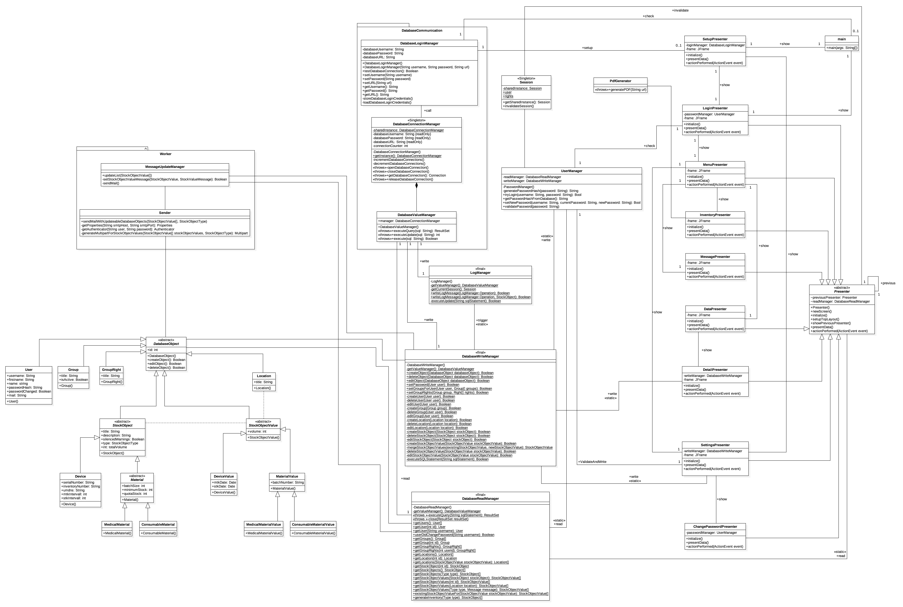

Vorläufiger Entwurf des Klassendiagramms, **request-for-comments**.

# Architekturmuster

Nachfolgend soll ein grober Überblick über die industriell gängigen Architekturmuster gegeben werden um die Erstellung der Projektarchitektur vorzubereiten.

- Model View Controller(MVC)
- Model View Presenter(MVP)
- Three-tier architecture

Die nachfolgenden Archtiekturen wurden nachträglich aus der Liste entfernt, da diese für die Implementierung des Projekts entweder nicht angemessen oder zu komplex erscheinen.

- Model View ViewModel *(nicht angemessen)*
- Reactive Programming *(zu komplex)*

## 1. Model View Controller

Dieses Architekturmuster sieht vor, dass die Software in die drei Einheiten **Datenmodell** (engl. model), **Präsentation** (engl. view) und **Programmsteuerung** (engl. controller) unterteilt wird. Ziel ist es, die Einheiten beim Programmentwurf autonom zu betrachten, so dass eine Änderung oder Erweiterung leichter zu verwirklichen ist und die Wiederverwendbarkeit der einzelnen Komponenten gegeben ist.

Die drei Einheiten führen je nach Implementierung die folgenden Aufgaben aus:

### 1.1 Model

Das **Model** enthält die Daten, welche später zur Darstellung bereitgestellt werden. Es soll vollkommen unabhängig von *View* und *Controller* sein. Die Bekanntgabe von Änderungen im Datenmodell geschieht über das *Observer-Pattern* (engl. Beobachter, das zu beobachtende Objekt bietet einen Mechanismus, um Beobachter an- und abzumelden und diese über Änderungen zu informieren) oder das *Delegation-Pattern* (engl. Abordnung, dynamische Methodenbindung zur Programmlaufzeit um methoden anderer Objekte auszuführen).

### 1.2 View

Der **View** ist für die grafische Darstellung von Daten und die Entgegennahme von Nutzerinteraktionen zuständig. Die Verarbeitung der eingegebenen Daten wird jedoch nicht von der *View* durchgeführt, sondern über die bereits erwähnten Entwurfsmuster wie Observer-Pattern oder Delegation-Pattern an den *Controller* weitergeleitet. Häufig wird für den *View* das *Composite pattern* (engl. Kompositum, zur Abbildung von Hierarchischen Strukturen in der Softwareentwicklung) verwendet um View-Hierarchien abzubilden. Gängige Attribute dafür sind beispielsweise `View subviews[]` und `View parentView`.

### 1.3 Controller

Im **Controller** werden ein oder mehrerer *Views* verwaltet und sämtliche Nutzereingaben entgegen genommen. An dieser Stelle werden Nutzereingaben ausgewertet und dem *Model* übergeben. Abhängig der Vorgaben bzw. der für die Programmiersprache typischen Konzepte findet sich hier auch eine Validierung von Eingaben oder eine Internationalisierung der vom *View* angezeigten Texte wieder. In einigen Implementierungen beinhaltet dieser Teil der Architektur einen Observer der *Model*-Daten, so wie die Möglichkeit die angezeigten *Views* zu aktualisieren.

## 2. Model View Presenter

Dieses Architekturmuster ging aus dem bereits vorher erwähnten **MVP-Pattern** hervor. Dabei legt es jedoch großen Wert darauf, dass *Model* und *View* vollständig von einander getrennt und über den *Presenter* verbunden sind. Der *Presenter* weiß als einziger Teil der Programmlogik sowohl vom *Model* als auch vom *View* bescheid (Umgekehrt ist der Presenter den beiden jedoch jeweils unbekannt).

Zur Implementierung des **MVP-Pattern** werden für *Model* und *View* jeweils Interfaces (engl. Schnittstelle, formale Deklaration der vorhandenen Funktionen und wie diese angesprochen werden können) definiert, welche jeweils den dahinterliegenden Aufbau definieren, aber auch von einander entkoppeln. So können auf einfachste Weise Funktionen der jeweiligen Einheiten ausgetauscht werden, ohne dass davon die Projektarchitektur betroffen ist.

Die von Martin Fowler vorgenommene Unterscheidung in **Supervising Controller** und **Passive View** soll soweit außer Acht gelassen werden, da diese für die Impelemtierung des Projekts voraussichtlich nicht von Interesse sein wird. Weitere Informationen dazu können in der Quelle [2.] nachgelesen werden.

## 3. Three-tier architecture

Die **Three-tier architecture** (engl. Drei-Schichten-Architektur) unterteilt eine Software in die drei Einheiten **Client Tier** (engl. Präsentationsschicht), **Application-Server Tier** (engl. Logikschicht) und **Data-Server Tier** (engl. Datenhaltungsschicht). Die erlaubten Beziehungen zwischen den einzelnen Schichten werden dahingehend eingeschränkt, dass Klassen einer höher gelegenen Schicht nur tiefer gelege Schichten verwenden dürfen.

Die häufigste Anwendung findet die **Three-tier architecture** in verteilten Systemen wie Client-Server Systemen, welche die Datenhaltung auf einem separaten Datenbankserver durchführen. Innerhalb eines Software-Systems ist die **Three-tier architecture** jedoch das Mindestmaß an architektonischer Struktur, welche verwendet werden sollte, sofern keine zwingenden Gründe für eine *echte* Architektur gegeben sind.

### 3.1 Client Tier

Die **Client Tier** ist für die korrekt formatierte Ein- und Ausgabe der Daten verantwortlich. Sie kümmert sich um die Korrekte Anzeige und das Layout des *User Interfaces*. Darüber hinaus ist sie für Benutzereingaben und Benutzerschnittstellen zuständig.

### 3.2 Application-Server Tier

Die **Application-Server Tier** ist für die Anwendungslogik selbst zuständig. Sie beinhaltet Verarbeitungsmechanismen zur Vorbereitung von Daten (für Darstellung oder Speicherung). Eine Validierung und Überprüfung von Ein- und Ausgabe-Daten findet in dieser Schicht statt.

### 3.3 Data-Server Tier

Die **Data-Server Tier** enthält die Datenbank bzw. kümmert sich im Falle eines Software-Systems um die Datenbank-Kommunikation oder die allgemeine Datenhaltung. Diese Schicht ist ausschließlich verantwortlich für das Laden und Speichern von Daten und Dateien, so wie für die Konvertierung von Datenbank-Feldtypen, um so für die *Application-Server Tier* eine gleichbleibende Sicht auf den Datenbestand zu gewährleisten. Diese Schicht ist speziell auf die Datenbank zugeschnitten und muss im Falle eines Umzugs auf ein abweichendes Datenbank-Management-System (DBMS) neu entworfen werden.

# Projektarchitektur

Zur Implementierung des Projekts wird die Anwendung einer **MVC** oder **MVP** Architektur empfohlen. Dadurch können die unterschiedlichen Abschnitte sauber von einander getrennt und in kleineren Teams gleichzeitig entwickelt werden. Für die Kommunikation zwischen den einzelnen Einheiten wird ein *Delegation-Pattern* empfohlen, da dieses auf den ersten Blick intuitiver und weniger überladen ist. Das *Observer-Pattern* wird dennoch innerhalb der *View*-Implementierung Anwendung finden, da Java-Swing mit diesem Muster arbeitet.

Von der Verwendung der **Three-tier architecture** für die Implementierung wird abgeraten, da diese eher in Verteilten Systemen zum Einsatz kommt. Da es sich bei der Anwendung jedoch in erster Linie um ein lokal ausgeführtes System handelt, ergibt dieses Architekturmuster im Kontext des Projekts keinen Sinn.

# Quellen
1. MVC, http://wiki.c2.com/?ModelViewController
2. MVC/MVP, http://martinfowler.com/eaaDev/uiArchs.html
3. 3-Tier, http://www.dfpug.de/konf/konf_1998/09_tier/d_tier/d_tier.htm
4. MVVM, https://www.norberteder.com/model-view-viewmodel-die-serie/
5. Reactive, http://reactivemanifesto.org
