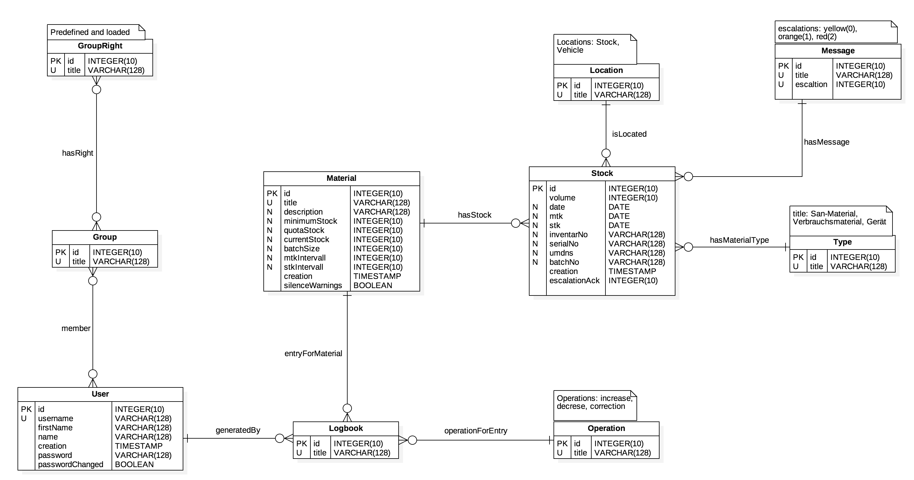

# SQL-Aufruf

Zunächst wird für das Projekt die Collation `latin1_german2_ci` verwendet, da diese am ehesten der "Telefonbuchsortierung" im deutschen entspricht. Alternativ wäre es auch denkbar gewesen `utf8_general_ci` zu verwenden, diese kann jedoch zu unerwarteten Sortierungen beim Aufkommen von Umlauten führen.

Für die Implementierung der `BOOLEAN` Werte wie passwordChanged und silenceWarning wird auf den Datentyp `TINYINT(1)` zurückgegriffen. Zum Thema BOOLEAN sagt die Dokumentation von MySQL folgendes:

- Bool, Boolean: These types are synonyms for TINYINT(1). A value of zero is considered false. Non-zero values are considered true.
- As of MySQL 5.0.3, the BIT data type is used to store bit-field values. A type of BIT(M) enables storage of M-bit values. M can range from 1 to 64.
- We intend to implement full boolean type handling, in accordance with standard SQL, in a future MySQL release.


## Group has Rights

Es handelt sich um eine **Many-To-Many Relationship** zwischen den Tabellen `Group` und `GroupRight`.

```sql
CREATE TABLE `GroupRight` (
    `id` int(10) unsigned NOT NULL AUTO_INCREMENT PRIMARY KEY,
    `title` varchar(128) COLLATE 'latin1_german2_ci' NOT NULL UNIQUE,
    `groups` int(10) unsigned NOT NULL
) COLLATE 'latin1_german2_ci';

CREATE TABLE `Group` (
    `id` int(10) unsigned NOT NULL AUTO_INCREMENT PRIMARY KEY,
    `title` varchar(128) COLLATE 'latin1_german2_ci' NOT NULL UNIQUE
) COLLATE 'latin1_german2_ci';


CREATE TABLE `GroupHasRights` (
    `group` int(10) unsigned NOT NULL,
    `right` int(10) unsigned NOT NULL,
CONSTRAINT `Constr_GroupHasRights`
    FOREIGN KEY `group_fk` (`group`) REFERENCES `Group` (`id`)
    ON DELETE CASCADE ON UPDATE CASCADE,
CONSTRAINT `Constr_RightHasGroups`
    FOREIGN KEY `right_fk` (`right`) REFERENCES `GroupRight` (`id`)
    ON DELETE CASCADE ON UPDATE CASCADE
) COLLATE 'latin1_german2_ci';
```
## User is Member of Group

Es handelt sich um eine **Many-To-Many Relationship** zwischen den Tabellen `User` und `Group`.

```sql
CREATE TABLE `User` (
    `id` int(10) unsigned NOT NULL AUTO_INCREMENT PRIMARY KEY,
    `username` varchar(128) COLLATE 'latin1_german2_ci' NOT NULL UNIQUE,
    `firstname` varchar(128) COLLATE 'latin1_german2_ci' NOT NULL,
    `name` varchar(128) COLLATE 'latin1_german2_ci' NOT NULL,
    `creation` timestamp NOT NULL,
    `password` varchar(128) COLLATE 'latin1_german2_ci' NOT NULL,
    `passwordChanged` tinyint(1) unsigned NOT NULL
) COLLATE 'latin1_german2_ci';

CREATE TABLE `UserIsMemberOfGroup` (
    `user` int(10) unsigned NOT NULL,
    `group` int(10) unsigned NOT NULL,
CONSTRAINT `Constr_UserHasGroup`
    FOREIGN KEY `user_fk` (`user`) REFERENCES `User` (`id`)
    ON DELETE CASCADE ON UPDATE CASCADE,
CONSTRAINT `Constr_GroupHasUser`
    FOREIGN KEY `group_fk` (`group`) REFERENCES `Group` (`id`)
    ON DELETE CASCADE ON UPDATE CASCADE
) COLLATE 'latin1_german2_ci';
```

## Material

Beinhaltet verschiedene **To-One Relationships** zwischen der `Material` Tabelle und den `Location`, `Message` und `Type` Tabellen.

```sql
CREATE TABLE `Location` (
    `id` int(10) unsigned NOT NULL AUTO_INCREMENT PRIMARY KEY,
    `title` varchar(128) COLLATE 'latin1_german2_ci' NOT NULL UNIQUE
) COLLATE 'latin1_german2_ci';

CREATE TABLE `Message` (
    `id` int(10) unsigned NOT NULL AUTO_INCREMENT PRIMARY KEY,
    `title` varchar(128) COLLATE 'latin1_german2_ci' NOT NULL UNIQUE,
    `escalation` int(10) unsigned NOT NULL UNIQUE
) COLLATE 'latin1_german2_ci';

CREATE TABLE `Type` (
    `id` int(10) unsigned NOT NULL AUTO_INCREMENT PRIMARY KEY,
    `title` varchar(128) COLLATE 'latin1_german2_ci' NOT NULL UNIQUE
) COLLATE 'latin1_german2_ci';

CREATE TABLE `Material` (
   `id` int(10) unsigned NOT NULL AUTO_INCREMENT PRIMARY KEY,
   `title` varchar(128) COLLATE 'latin1_german2_ci' NOT NULL UNIQUE,
   `minimumStock` int(10) unsigned NULL,
   `currentStock` int(10) unsigned NULL,
   `batchSize` int(10) unsigned NULL,
   `date` date NULL,
   `mtk` date NULL,
   `stk` date NULL,
   `mtkIntervall` int(10) unsigned NULL,
   `stkIntervall` int(10) unsigned NULL,
   `creation` timestamp NOT NULL,
   `inventarNo` varchar(128) COLLATE 'latin1_german2_ci' NULL,
   `serialNo` varchar(128) COLLATE 'latin1_german2_ci' NULL,
   `umdns` varchar(128) COLLATE 'latin1_german2_ci' NULL,
   `silenceWarning` tinyint(1) unsigned NOT NULL,
   `location_id` int(10) unsigned NOT NULL,
   `type_id` int(10) unsigned NOT NULL,
   `message_id` int(10) unsigned NULL
) COLLATE 'latin1_german2_ci';
```

## Logbook

Beinhaltet verschiedene **To-One Relationships** zwischen der `Logbook` Tabelle und den `Material` und `Operation` Tabellen.

```sql
CREATE TABLE `Operation` (
    `id` int(10) unsigned NOT NULL AUTO_INCREMENT PRIMARY KEY,
    `title` varchar(128) COLLATE 'latin1_german2_ci' NOT NULL UNIQUE
) COLLATE 'latin1_german2_ci';

CREATE TABLE `Logbook` (
    `id` int(10) unsigned NOT NULL AUTO_INCREMENT PRIMARY KEY,
    `title` varchar(128) COLLATE 'latin1_german2_ci' NOT NULL UNIQUE,
    `material_id` int(10) unsigned NULL,
    `operation_id` int(10) unsigned NOT NULL,
    `user_id` int(10) unsigned NOT NULL
) COLLATE 'latin1_german2_ci';
```


## Insert

```sql
INSERT INTO `Operation` (title)
VALUES
('create-user'),
('delete-user'),
('modifie-user'),
('create-userRight'),
('delete-userRight'),
('modifie-userRight'),
('create-material'),
('delete-material'),
('modifie-material'),
('material-increase'),
('material-decrese'),
('material-correction');

INSERT INTO `Group` (title)
VALUES ('admin'), ('user');

/* pw = md5(test) */
INSERT INTO `User` (username, firstname, name, password, passwordChanged)
VALUES ('root', 'test', 'test', '098f6bcd4621d373cade4e832627b4f6', 0);

INSERT INTO `UserIsMemberOfGroup` VALUES (1,1);

INSERT INTO `Logbook` (title, material_id, operation_id, user_id)
VALUES ('Initialisation', NULL, 6, 1);
```

## Select

Alle User die der Gruppe ``admin`` angehören:

```sql
SELECT
    `User`.*
FROM
    `User`
    JOIN `UserIsMemberOfGroup` ON `User`.`id` = `UserIsMemberOfGroup`.`user`
WHERE
    `UserIsMemberOfGroup`.`group` = 1
```

Alle Gruppen in denen der Nutzer ``root`` ist:

```sql
SELECT
    `Group`.*
FROM
    `Group`
    JOIN `UserIsMemberOfGroup` ON `Group`.`id` = `UserIsMemberOfGroup`.`group`
WHERE
    `UserIsMemberOfGroup`.`user` = 1
```
